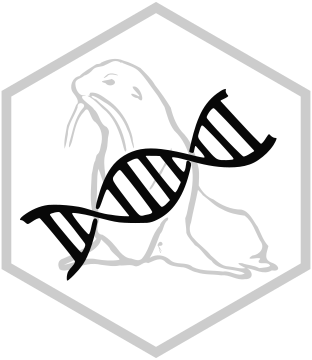

# Antarctic Fur Seal Dovetail Genome 

**Authors:** Kosmas Hench and David Vendrami

This repository contains the code for the study *Refinement of the Antarctic fur seal (Arctocephalus gazella) reference genome increases continuity and completeness* by Hench et al.

## General Overview

> **Important Note on Genome Names:**<br>
> This code was developed prior to the submission of the genomes to NCBI.
> Therefore, all code included here expects the "preliminary version" of the genomes.
> 
> However, for the final submission it was necessary to rename the assembly files and to slightly adjust the scaffold names (removing the problematic characters `;` and `=`, which are prohibited by NCBI).
> The preliminary and final versions (submitted to NCBI) of the genomes are equivalent, in every aspect except for the update of the scaffold names (to adhere to NCBI regulations).
>
> | | preliminary version | final version |
> |--:|:-----|:---|
> | file | `arcgaz_anc_h1.fa` | `arcGaz4_h1.fa` |
> | example seq | `>ScDpJTZ_100;HRSCAF=126` | `>ScDpJTZ_100_HRSCAF_126` |
> | file | `arcgaz_anc_h2.fa` | `arcGaz4_h2.fa` |
> | example seq | `>Sc3htSU_100;HRSCAF=118` | `>Sc3htSU_100_HRSCAF_118` |
> 
> Also, the multi-species alignment of submitted to dryad contains the *preliminary version* of the haplotype 1 genome assembly.

The analysis for this study consists of two major blocks:
the first block entails genome assembly related code, while the second block includes the post-assembly analysis.

The **genome assembly related code** includes all steps that were necessary to get from the original HiRise assemblies provided by dovetail to the final files `arcGaz4_h1.fa` and `arcGaz4_h2.fa`.
Furthermore, it includes code related to the characterization of the new genome assemblies (eg. the BUSCO scoring and the compilation of assembly statistics like the N50).

The **post-assembly code** covers the multi-species alignment and the analysis thereof.
This includes the `cactus` alignment, the calling of evolutionary conservation scores with `gerp++`, the estimation of genetic differentiation and the gene ontology enrichment analyses.

The analysis was managed using the workflow manager `snakemake`.
High level commands to run specific parts of the analysis are given below.

> The following examples are triggering a dry-run of the selected pipline part. For an actual re-run the `-n` flag needs to be replaced, depending on the setup (s. [snakemake documentation](https://snakemake.readthedocs.io/en/stable/executing/cli.html#useful-command-line-arguments)).


## Assembly Related Code

### Alignment Guided Anchoring

**Step 01:** The alignment of the initial *de novo* assemblies by dovetail with the previous reference genome (arcGaz3) can be triggered with as follows (most relevant code lives within `repeat_mask.smk` and `anchor.smk`):

```sh
snakemake -n --configfile workflow/config_anchoring.yml -R align
```

**Step 02:** The alignment guided anchoring of the initial dovetail assemblies can be re-run using (most relevant code lives within `anchor.smk`):

```
snakemake -n --configfile workflow/config.yml -R anchor
```

### Assembly QC

**Step 03:** Compilation of the genome stats (most relevant code lives within `genome_stats.smk`):

```sh
snakemake -n --rerun-triggers mtime --configfile workflow/config_all_genomes.yml -R fa_stats
```

**Step 04:** BUSCO scoring happens within (most relevant code lives within `busco_and_blast.smk`):

```sh
snakemake -n --configfile workflow/config.yml --rerun-triggers mtime -R all_blast
```

## Post-assembly Analysis

### Multi species Alignment 

**Step 05:**  Downloading reference genomes from NCBI:

```sh
snakemake -n --configfile workflow/config.yml -R ncbi_download
```

**Step 06:** To conduct the `cactus` alignment, first a preparation step is required (relevant code in `cactus_prep.smk`):

```sh
snakemake -n --configfile workflow/config.yml -R cactus_prep
```

**Step 07:** This followed by the actual alignment (which will only be possible after the preparation step above, relevant code in `cactus_stepwise.smk`)

```sh
snakemake -n --configfile workflow/config.yml -R cactus_stepwise
```

**Step 08:** To update the resulting `hal` file with re-estimates the neutral branch length, run (code in `hal_conversions.smk`, `coverage_check.smk` and `neutral_branch_lengths.smk`):

```sh
snakemake -n --configfile workflow/config.yml -R create_neutral_tree
```

### Comparative Analysis

**Step 09:** Then, to run the conservation scoring with `grep++` and estimate FST values, run (code in `snp_to_vcf.smk` and `fst_and_gerp.smk`):

```sh
snakemake -n --configfile workflow/config.yml -R win_and_busco
```

**Step 10:** Finally, the execution of the GO enrichment analysis and the plotting of the results can be done with (code in `go_and_plots.smk`):

Note that the `R` environment (`R` and package versions) for creating the final figures is captured within the file `renv.lock`.
It should be possible to re-create this `R` environment by running `renv::restore()` (s. [renv documentation](https://rstudio.github.io/renv/index.html)).

```sh
snakemake -n --configfile workflow/config.yml -R final_plots
```


## Dependencies

### Data

For the first block of the analysis, four addtional genomes are required:

```sh
data/
└── genomes
    ├── arcgaz_dt_h1.fa.gz # haplotype 1 from the dovetail assembly
    ├── arcgaz_dt_h2.fa.gz # haplotype 2 from the dovetail assembly
    ├── arcgaz_v1.fa.gz    # the old antarctic fur seal reference genome
    └── zalcal_v1.fa.gz    # the california sea lion reference genome
```

The included external genomes are:

- *Arctocephalus gazella* ([Antarctic fur seal v1](https://www.ncbi.nlm.nih.gov/assembly/GCA_900642305.1), **GenBank** GCA_900642305.1)
-  *Zalophus californianus* ([California sea lion v1](https://www.ncbi.nlm.nih.gov/assembly/GCF_009762305.2/), **RefSeq** GCF_009762305.2)

### Code

The `R` scripts used to create the final figures rely on two small custom `R` packages (`arcgazgen` and `hypoimg`, installable with `remotes`):

```R
remotes::install_github("k-hench/arcgazgen")
remotes::install_github("k-hench/hypoimg")
```

### Computing Environments 

The computing environment used during the analysis is captured with a combination of `conda` environments and `docker` containers.

The used `conda` environments are specified in `yml` files located in the directory `workflow/envs/`.

To install a specific `conda` environment (e.g. `allmaps`), run: 

```sh
cd workflow/envs/
conda env create -f allmaps.yml
```

The used containers are:

| in `snakemake` | local filename | link | comet |
| -------------- | -------------- | ---- | ----- |
| `c_cactus` | `cactus_v2.5.1.sif` | [quay.io/comparative-genomics-toolkit/cactus:v2.5.1](https://quay.io/repository/comparative-genomics-toolkit/cactus?tab=tags&tag=v2.5.1) | for the alignment |
| `c_cactus` | `cactus_v2.6.12.sif` | [quay.io/comparative-genomics-toolkit/cactus:v2.6.12](https://quay.io/repository/comparative-genomics-toolkit/cactus?tab=tags&tag=v2.5.1) | for the post-alignment analysis |
| `c_vcfh` | `vcftools_haploid_v0.1.sif` | [docker://khench/vcftools_haploid:v0.1](https://hub.docker.com/r/khench/vcftools_haploid) |  |
| `c_conda` | `conda_byoe.sif` | not online | contains `conda` environments specified in `workflow/envs` |

---
